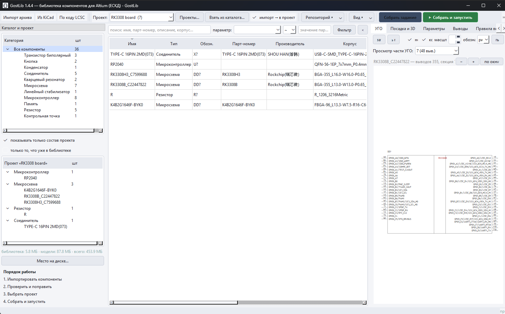
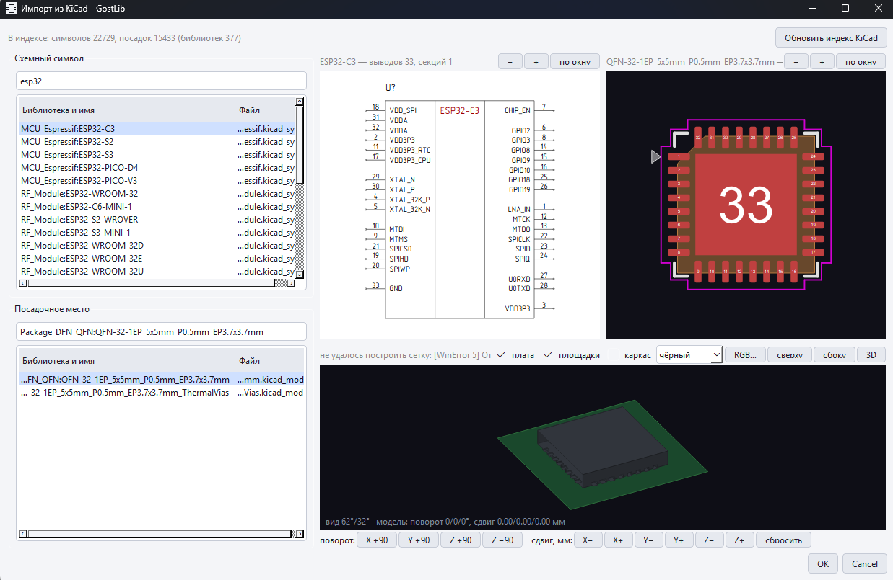
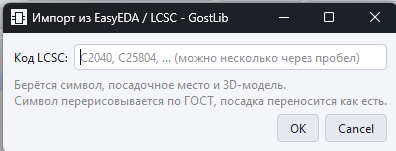
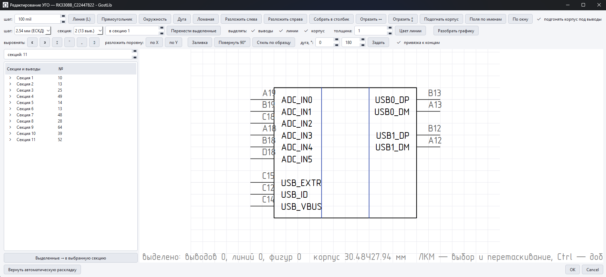
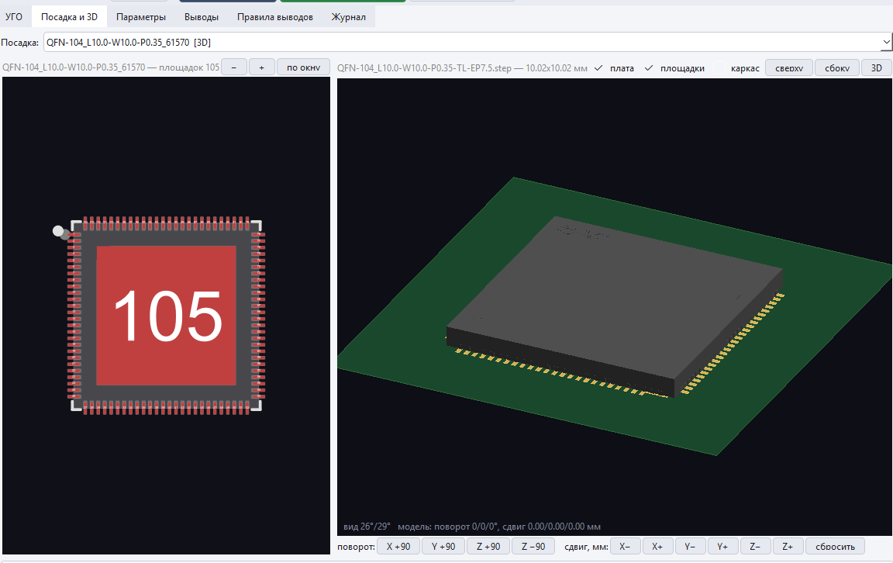
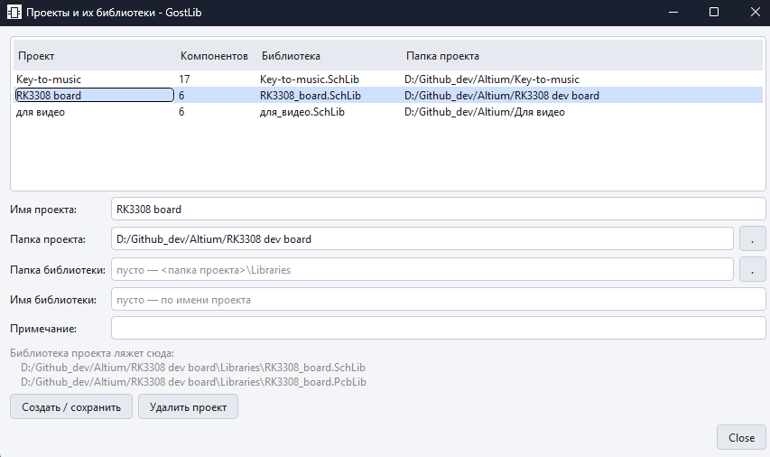
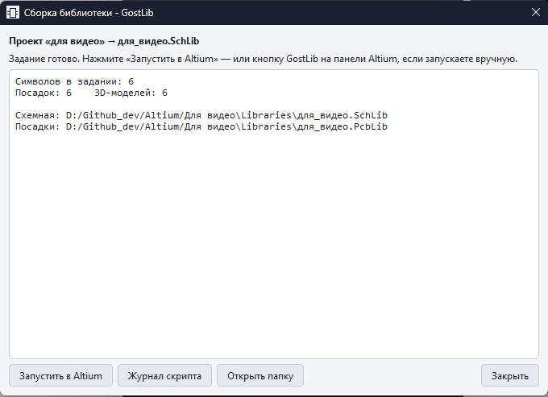

# GostLib

**Менеджер библиотеки компонентов для Altium Designer с оформлением условных
графических обозначений по ЕСКД.**

Импортирует компоненты из KiCad, EasyEDA/LCSC, архивов SnapEDA и
UltraLibrarian, рисует символы по ГОСТ, переносит посадочные места и 3D-модели
один в один и обновляет библиотеки в Altium одним нажатием — **не открывая
редактор библиотек и не проходя мастер импорта**.

`Windows 10/11` · `Altium Designer` · `Python 3.10+` · `MIT`


---

## Посмотреть за пять минут

| | |
|---|---|
| 📺 **[Обзор: что это и как работает](https://vkvideo.ru/video-230514924_456239026)** | как выглядит и что делает |
| 📺 **[От импорта до платы](https://vkvideo.ru/video-230514924_456239025)** | полный цикл на живом проекте |
| 📄 **[Статья на Хабре](https://habr.com/ru/articles/1079698/)** | зачем это было сделано и как устроено внутри |
| 📦 **[Скачать готовый установщик](../../releases)** | Python и библиотеки не нужны |

---

## Зачем

Новый проект в Altium упирается в одно и то же: компонентов нет. Дальше два
пути, и оба плохие.

**Рисовать руками** — символ по ЕСКД, посадочное место по даташиту, 3D-модель,
параметры, привязки. Час на компонент, и так пятьдесят раз. Через полгода
половина библиотеки в одном стиле, половина в другом.

**Тащить готовое** — в KiCad, на LCSC и в SnapEDA есть почти всё, но мастер
импорта Altium отдаёт безликие прямоугольники вместо ГОСТ-обозначений, теряет
3D-модели, ломает овальные отверстия и переносит скрытые выводы, которых в
Altium быть не должно. После импорта всё равно садишься править руками.

GostLib закрывает обе задачи разом: компонент приезжает из источника уже
оформленным по ГОСТ, с посадкой, 3D-моделью и параметрами, а библиотеку
собирает **сам Altium** своим штатным API — ничего не подделывается и не
пишется в обход форматов.

---

## Быстрый старт

**1. Поставить.** Скачать установщик со страницы [Releases](../../releases) и
запустить. Либо из исходников:

```bat
git clone https://github.com/Madjogger1202/GostLib.git
cd GostLib
install.bat
run.bat
```

**2. Указать папку библиотеки** — «Настройки → Библиотека». Туда лягут
`.SchLib` и `.PcbLib`.

**3. Проверить путь к Altium** — там же в настройках, поле `X2.EXE`. Обычно
программа находит его сама; заполнять вручную нужно, только если Altium
установлен не в стандартную папку.

Больше в Altium настраивать нечего: скрипт, который строит библиотеки, кладёт
и запускает сама программа. Ни подключать проект скриптов, ни вытаскивать
кнопки на панель не надо.

**4. Импортировать компонент.** «Из KiCad» — с предпросмотром символа по ЕСКД,
посадочного места и 3D-модели ещё до импорта:



Или по коду LCSC — приедет символ, посадка и 3D-модель из EasyEDA:



**5. Собрать: `Shift+F9`.** Программа сама поднимет Altium (или отдаст команду
уже открытой копии), выполнит скрипт и покажет, что реально построилось.
`F9` — только подготовить задание, без запуска.

Подробно, с разбором граблей — **[docs/БЫСТРЫЙ-СТАРТ.md](docs/БЫСТРЫЙ-СТАРТ.md)**.

---

## Что умеет

### Символы по ЕСКД

Микросхемы рисуются заново по ГОСТ 2.743 — прямоугольник с основным и
дополнительными полями, имена выводов внутри, номера снаружи. Пассивка, диоды
и транзисторы берутся из источника как есть: и в KiCad, и в EasyEDA они уже
нарисованы верно, а двунаправленный супрессор по одному списку выводов от
обычного диода не отличить. Что рисовать — ГОСТ или источник — переключается у
каждого компонента. Многосекционные символы, у каждой секции свои габариты.

Группировка выводов задаётся **текстом**, который правится прямо в программе:
питание, земля, дифференциальные пары, шины. Что не подошло под правила —
раскладывает автоматика.



В редакторе (`F4`) — линии, прямоугольники, окружности, дуги и ломаные,
выравнивание и распределение, привязка к концам линий и выводам, поворот,
заливка, стиль по образцу. Обозначение любой сложности рисуется целиком внутри
программы.

### Посадочные места и 3D

Геометрия переносится один в один. **Переходные отверстия под площадками не
переносятся никогда** — правило по ширине ободка, а не по совпадению номера.
Овальные отверстия едут вместе с углом, а не превращаются в круглые.



OBJ и STL переводятся в STEP, который понимает Altium; цвета материалов
переносятся, а выбранный цвет корпуса пишется прямо в файл модели — в Altium
корпус будет ровно такой, как в просмотре. Файл, выбранный руками, не
трогается никогда.

Зазоры маски и пасты задаются **у каждого посадочного места**: у BGA один, у
QFN с тепловым пятаком другой. Есть галочка «наносить пасту» на весь компонент
и сетка окон пасты для тепловых пятаков.

### Каталог и проекты

Одна общая библиотека плюс **своя библиотека на каждый проект Altium**.
Компонент лежит в каталоге один раз и входит в проекты ссылкой — правка
резистора доезжает во все проекты сразу.



`Ctrl+Z` / `Ctrl+Y` отменяет и возвращает любое действие: смену типа,
переименование, удаление, раскладку выводов, состав проекта, правку в таблице.

### Работа командой

Каталог живёт в SQLite, а для git есть **текстовое зеркало**: по файлу JSON на
компонент плюс оглавление. Выгрузка устойчива — одна и та же библиотека даёт
байт в байт те же файлы, поэтому diff показывает только настоящие изменения.
Синхронизация в обе стороны; расхождения по одному компоненту не разрешаются
молча, а показываются списком.

### Сборка

Собирает **сам Altium** своим API по текстовому заданию. По завершении скрипт
кладёт рядом отчёт о том, что реально создал, — программа сверяет его с
заданием и говорит прямо, всё построилось или нет.



---

## Что нового в 1.4

- Полностью отлажен и продвинут **многосекционный импорт**.
- **Зазоры маски и пасты** — у каждого компонента отдельно, плюс галочка
  «наносить пасту» и сетка окон для тепловых пятаков.
- **Импорт из KiCad с предпросмотром**: символ, посадочное место и 3D-модель
  видно до импорта.
- **Редактор цвета 3D-модели** — цвет пишется в сам файл и виден в Altium.
- **Совместимость с контролем версий** как опция: текстовое зеркало библиотеки
  для git.
- **Размер приложения уменьшен почти вдвое**, импорт заметно быстрее.
- **Родное УГО из EasyEDA/LCSC** — обозначение из источника сохраняется и
  выбирается так же, как при импорте из KiCad.

Полный список изменений — в [Releases](../../releases).

---

## Требования

| | |
|---|---|
| Система | Windows 10/11 x64 |
| Altium | Designer; нужен **только для сборки библиотек** |
| Python | 3.10+ — если запускаете из исходников; для установщика не нужен |
| Обязательные пакеты | `PySide6`, `olefile` |
| Для просмотра 3D телом | `trimesh`, `cascadio` — ставятся командой `gostlib.bat setup3d` |

Импорт, отрисовка символов, разбор посадок и просмотр 3D работают **без
Altium**. Он нужен только в момент сборки библиотек.

---

## Документация

| Раздел | О чём |
|---|---|
| [Быстрый старт](docs/БЫСТРЫЙ-СТАРТ.md) | от установки до первого компонента в Altium |
| [Установка и сборка](docs/УСТАНОВКА.md) | установщик, из исходников, свой `exe`, что делать, если не завелось |
| [Импорт компонентов](docs/ИМПОРТ.md) | KiCad, LCSC, архивы, чужие библиотеки Altium — и особенности каждого источника |
| [Работа с каталогом](docs/РАБОТА.md) | рабочий цикл, проекты, редактор УГО, посадка и 3D, сборка |
| [Настройки](docs/НАСТРОЙКИ.md) | все важные параметры: стиль ЕСКД, шрифты, подробность 3D, зазоры, правила выводов |
| [Командная работа и git](docs/КОМАНДА-И-GIT.md) | текстовое зеркало библиотеки, синхронизация между машинами |
| [Раскладка выводов через ИИ](docs/ИИ-РАСКЛАДКА.md) | как получить вменяемое УГО у микросхемы на 300 выводов |
| [Для разработчика](docs/ДЛЯ-РАЗРАБОТЧИКА.md) | устройство, формат задания, грабли DelphiScript, самопроверка |

---

## Помощь и обратная связь

Не заработало или ведёт себя странно — заводите
[Issue](../../issues). Полезно приложить:

- журнал сборки `%LOCALAPPDATA%\GostLib\jobs\build_*.txt.log`;
- отчёт о падении `%LOCALAPPDATA%\GostLib\crash.log`, если программа закрылась
  сама;
- версию Altium и версию GostLib (она в заголовке окна).

Правки принимаются через Pull Request. Перед отправкой прогоните
`gostlib.bat selftest` и `gostlib.bat lint`, а на новое поведение добавьте
проверку — подробности в [docs/ДЛЯ-РАЗРАБОТЧИКА.md](docs/ДЛЯ-РАЗРАБОТЧИКА.md).

---

## Лицензия

[MIT](LICENSE).

Altium Designer, KiCad, EasyEDA, LCSC, SnapEDA и UltraLibrarian — товарные
знаки своих владельцев. Проект с ними не связан.
